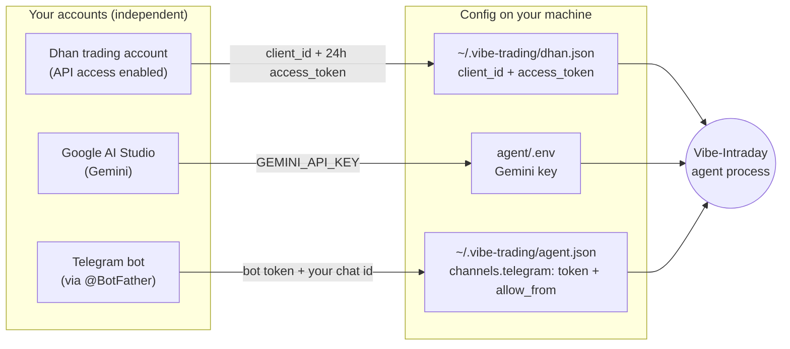

# Vibe-Intraday

A **personal, self-hosted NSE intraday (MIS) trading assistant** built on
[HKUDS/Vibe-Trading](https://github.com/HKUDS/Vibe-Trading) (MIT). It reads live
Indian market data from **Dhan**, decides trades with **fast rule-based signal
engines**, uses **Gemini** for pre-market research and end-of-day review, and posts
**every trade to Telegram**. Paper-first, small ₹25–50k live trial. Long-only in live;
since 2026-07-16 the paper bake-off also runs **short-capable hybrid twins** (the 3L
long-vs-hybrid A/B — paper only).

> Full strategy and milestones: [`IMPLEMENTATION_PLAN.md`](IMPLEMENTATION_PLAN.md).
> Diagrams: [`docs/FLOWS.md`](docs/FLOWS.md). This README covers architecture,
> how the accounts link, and getting it running.

---

## What it does

- Pulls live NSE 15-minute bars + quotes from your Dhan account.
- Runs rule engines (opening-range breakout, pullback-buy, momentum, …) each interval —
  long-only slots plus, since 2026-07-16, `_ls` hybrid twins that may also short (paper A/B).
- Simulates MIS fills (paper) or places real MIS orders (live, later) behind a risk mandate.
- Force-squares-off every open position by ~15:15 IST (before Dhan's auto-close).
- Gemini builds the morning watchlist and writes an EOD trade-journal review — it does **not** make per-bar trade calls.
- Posts every entry / exit / square-off / halt to a Telegram channel.

## What it is NOT
Not shorting **with real money** (paper-only 3L A/B; the live/M2 gate stays long-only),
not F&O/options, not overnight/delivery, not multi-user, not HFT, not an
LLM placing orders bar-by-bar. See the plan's non-goals.

---

## Architecture

```
                         ┌─────────────────────────────────────────┐
                         │   Vibe-Intraday agent (self-hosted)      │
                         │   one process = the hub                  │
   Dhan account ─────────┤  • Dhan connector (data + orders)        │
   (data + execution)    │  • India intraday MIS engine (long-only) │
                         │  • rule-based signal engines             │
   Gemini API ───────────┤  • Gemini: pre-market + EOD (research)   │
   (research/oversight)   │  • mandate gate + kill switch (live)     │
                         │  • trade-event notifier ────────────────┼──→  Telegram channel
   Telegram bot ─────────┤  • market-hours scheduler (IST)          │        (all trades)
   (notifications)       └─────────────────────────────────────────┘
```

| Layer | Component | Source |
|---|---|---|
| Market data | Dhan `dhanhq` SDK → `DhanBarSource` (15m; numeric `security_id`) / `ReplayBarSource` (offline) | ours, `agent/src/intraday/bars.py` |
| Backtest/exec engine | `IndiaEquityEngine` + **intraday MIS mode** (long-only by default; `allow_short` opt-in for 3L) | repo, `agent/backtest/engines/` |
| Paper fills | `PaperBroker` (MIS, reuses engine cost/slippage; longs + 3L paper shorts, one direction per symbol) | ours, `agent/src/intraday/paper_broker.py` |
| Signals | `SignalEngine` rule classes (no-arg = long-only; `allow_short=True` builds the hybrid twin from the same source) | ours, `strategies/` |
| Research | Gemini via LangChain provider (stub until key set) | ours, `agent/src/intraday/gemini_jobs.py` |
| Order safety (live) | mandate + halt + daily-count + audit | repo, `agent/src/live/` (M2) |
| Notifications | one-way Telegram sink / log sink + trade notifier | ours, `agent/src/intraday/notifier.py` |
| Orchestration | market-hours IST loop + 15:15 flatten | ours, `agent/src/intraday/runner.py` |

**Why this shape:** deterministic rule engines make intraday entries/exits (testable,
low-latency, no API cost per bar); the LLM is used only where judgement helps and latency
doesn't (before and after the session). This is the "research + oversight" decision. The M1
paper runtime lives in a self-contained `agent/src/intraday/` overlay and never edits the
base repo's protected agent/session internals; the repo's LLM-autonomous `LiveRunner` is the
separate M2 (gated live) path.

### Run the paper loop (placeholder-first)

The runtime runs **today with no credentials** — Telegram → log sink, Gemini → deterministic
stub, bars → offline replay. Drop real values into the placeholders to activate each live path,
no code change required.

```
cp agent/.env.example agent/.env                      # then edit: GEMINI/DHAN/TELEGRAM (placeholders OK)
cp agent/config/intraday.example.json agent/config/intraday.json   # fill each symbol's Dhan security_id
cd agent && set PYTHONPATH=. && python -m pytest tests/test_intraday_runtime.py -q   # 25 green
```

`IntradayConfig.load()` resolves defaults ← `config/intraday.json` ← env (`agent/.env`). Its
`is_telegram_configured` / `is_gemini_configured` / `is_dhan_configured` predicates drive the
live-vs-stub wiring, so partial creds are fine (e.g. Telegram live while Gemini still stubbed).
`config/intraday.json` and `agent/.env` are gitignored — secrets never commit.

### Run the week-1 bake-off (real creds — live since 2026-07-15)

One invocation = one paper trading day of the **42-slot roster** (20 long-only rule engines,
including 5 TradingView ports and the OI×DMA×ADX confluence — since 2026-07-16 their 20
short-capable `_ls` hybrid twins for the 3L A/B — and, since 2026-07-18, **two local-LLM
candidate slots** `llm_local_a` (llama3.1:8b) / `llm_local_b` (qwen3:8b) on a local Ollama
server (§3R: zero marginal cost, no quota; long-only; measured 38-symbol latency 14–21s on the
RTX 5070); ₹25k each, **₹10.5L total paper**) over a **38-stock Nifty universe** (3J scan;
structural filters only — median price ≤ ₹3,000 + liquidity). The experimental `llm_trader`
**Gemini** slots were retired on cost grounds after 2026-07-16 (§3M) — Gemini is
research/oversight only (watchlist + EOD review, now with transient retry + `[local]` Ollama
fallback, §3O). A pre-tick preflight builds every slot — hybrid flags **and** per-slot LLM
params — and exits if any can't load (fallback: `config/intraday.long21.json`, the preserved
20-slot long-only roster). Every morning:

1. Refresh the Dhan access token in `agent/.env` (**expires every 24h**).
2. Double-click **`start_bakeoff.bat`** (project root) — or run
   `cd vibe-trading\agent && set PYTHONPATH=. && python -m src.intraday.bakeoff`.

The launcher posts the Gemini pre-market watchlist to Telegram, waits for the 09:15 bell, ticks
all sixty-four slots every 15m on live Dhan bars (one shared fetch per symbol; hourly rollups →
Telegram — since **B4-2** each report collapses to **one line per long/`_ls` pair** (long ₹ · ls ₹ ·
short leg · Δ = ls − long), all pairs movers-first, halted pairs always shown, under a hard 3-chunk
cap, with the full per-fill tape in the log), force-flattens at 15:15, and after close posts the EOD
scoreboard (topline `Σ net · fees · trades · P of M slots profitable`) + Gemini journal review
(pair-collapsed aggregate lines past 40 fills). Per-day log:
`agent/logs/bakeoff-YYYYMMDD.log`; weekly scoreboard: `~/.vibe-trading/intraday/scoreboard.json`.

**Short data-drop resilience (3N):** before each tick the runner probes the feed; a Wi-Fi / data
drop up to **`reconnect_budget_seconds` (default 300 = 5 min)** is ridden out with backoff and the tick
resumes automatically — no human intervention, no missed bar. A drop longer than the budget just holds
that one bar and retries next tick. (This covers *network* drops while the process is alive; surviving a
*process/host crash* is the separate BUG-004 state-persistence item.)
`--max-ticks N` gives a bounded probe run; Dhan creds come from `agent/.env` (no `dhan.json`
needed — DC-003 in `docs/BUGS.md`).

### Cost model (verified 2026-07-17 — §3Q)

The engine charges the full NSE equity-intraday (MIS) stack per executed order
(`backtest/engines/india_intraday.py::calc_commission`; rates configurable via the `in_*` keys):

| Component | Rate | Leg |
|---|---|---|
| Brokerage | **min(₹20, 0.03% × notional)** | both |
| STT | 0.025% | sell only |
| Stamp duty | 0.003% | buy only |
| Exchange txn (NSE) | 0.00297% | both |
| SEBI turnover fee | 0.0001% | both |
| GST | 18% on (brokerage + exchange + SEBI) | both |

Two clarifications that came out of the 07-17 verification (hand-computed = engine to 4 decimals,
and matching Dhan's published tariff):

- **"₹20 per order" is the cap, not a flat fee.** Dhan's tariff is `min(₹20, 0.03%)` — exactly
  what the engine charges. The ₹20 only binds above **₹66,667 notional** per order; at our ~₹6k
  position sizes the 0.03% (~₹1.80/leg) is what's actually paid.
- **The ~0.106% round trip the reports show is the all-in stack**, not brokerage alone
  (brokerage×2 + STT + stamp + exchange×2 + SEBI + GST).

Worked example (1 × ADANIENT @ ₹3,160, from the 07-17 session log):

```
BUY  fee ₹1.33 = brokerage 0.95 + exchange 0.09 + SEBI 0.00 + GST 0.19 + stamp 0.09
SELL fee ₹2.02 = brokerage 0.95 + exchange 0.09 + SEBI 0.00 + GST 0.19 + STT  0.79
round trip ₹3.35 on ₹3,160 ≈ 0.106% of notional
```

Sizing note: below the brokerage cap every component is proportional to notional, so fees are a
flat **≈0.106% of turnover** regardless of order size — the fee *percentage* only starts falling
as order size approaches ₹66.7k (where the ₹20 cap kicks in). Bigger per-strategy capital doesn't
dilute costs at our sizes; fewer round trips does.

---

## How your three accounts link

There is **no cross-account OAuth** — the three services never talk to each other. Your
single self-hosted agent instance is the hub; it holds one independent credential per
service, in three config locations, and wires them together at runtime.



### 1. Dhan (data + execution)
1. Open a Dhan account and enable **DhanHQ API access** at web.dhan.co (Profile → DhanHQ APIs).
2. Copy your **Client ID** and generate an **Access Token** (valid **24 hours** — must be refreshed daily for autonomy).
3. Register it with the connector: `vibe-trading connector configure dhan-live-sdk-readonly` (prompts for `client_id` + `access_token`; stored in `~/.vibe-trading/dhan.json`).
4. Data API is free if you've traded 25+ times in the last 30 days, otherwise ₹499+GST/month.

### 2. Gemini (research + oversight)
1. Create an API key in Google AI Studio.
2. In `agent/.env`:
   ```
   LANGCHAIN_PROVIDER=gemini
   LANGCHAIN_MODEL_NAME=gemini-3.5-flash
   GEMINI_API_KEY=your-key-here
   ```

### 3. Telegram (trade notifications)
1. In Telegram, message **@BotFather** → `/newbot` → copy the **bot token**.
2. Create a channel (or group), add the bot as an **admin**, and get the channel/chat **id** (e.g. via @userinfobot or the getUpdates API).
3. Configure the channel in `~/.vibe-trading/agent.json` (or via the Web UI **Settings → Channels**):
   ```json
   { "channels": { "telegram": { "enabled": true, "token": "<bot-token>", "allow_from": ["<your-chat-id>"] } } }
   ```
4. The agent posts trade events here. Telegram is a **notification sink only** — it never places or approves orders.

> Everything sensitive (`.env`, `dhan.json`, `agent.json`, tokens) stays on your machine and is **never committed** — see `CLAUDE.md`.

---

## Quick start (Milestone M0 — read-only)

```bash
# 1. Get the base repo (Phase 3 Step 0 pins the permanent location)
pip install vibe-trading-ai dhanhq

# 2. Configure credentials (see "How your three accounts link" above)
#    - agent/.env       : Gemini
#    - dhan.json        : Dhan client_id + access_token
#    - agent.json       : Telegram token + allow_from

# 3. Verify Dhan reads live data (read-only, no orders)
vibe-trading connector use dhan-live-sdk-readonly
vibe-trading connector check
vibe-trading connector quote RELIANCE.NS
vibe-trading connector history RELIANCE.NS --interval 15m

# 4. Verify Gemini answers a research prompt, and Telegram receives a test message
```

M1 (paper intraday loop) and M2 (gated live) build on this — see the plan.

---

## Status
Phase 3 (Develop) / M1 paper bake-off **live**. Long-only live + paper-first locked (shorts are
paper-only `_ls` twins, 3L). Ranking week runs from 2026-07-17 on the 38-stock universe; roster
is 42 slots from 2026-07-18 (§3R local-LLM candidates added), then **64 slots from 2026-07-20**
(§3S: 11 more TradingView ports — bb_rsi, macd_sma200, macd_rsi, pmax, hull_suite, ao_stoch,
golden_cross, flawless_victory, ema_cross, ichimoku, rsi_div — each added as a long + `_ls` twin;
₹16L paper; validate_roster builds 64 + 20 fallback; ~1.1 s/tick scale-checked). Total `strategies/`
run-dirs: **38** (§3U added 7 Tier-1 shortlist ports — cpr_pivot, psar_flip, supertrend_vwap,
donchian, keltner, stoch_rsi, connors_rsi2 — **offline only; live roster unchanged at 64**). M2 (gated
live) not started. **B4-2 DONE (2026-07-19):** the Telegram report was reworked for 64 slots —
pair-collapse (one line per long/`_ls` pair, A/B Δ), all pairs movers-first in the hourly, halted
always visible, hard 3-chunk cap — cutting the hourly from 4→1 chunk and the EOD scoreboard from 2→1.
**Offline ranking:** `strategies/backtest_all.py` = quick single-window P&L; `strategies/evaluate_strategies.py`
= robustness ranker (breadth over 49 cached symbols × walk-forward folds × cost sensitivity →
`docs/STRATEGY_EVALUATION.md`). Both are one-regime signals — the live paper weeks are the arbiter.
Next-batch candidates curated in `docs/STRATEGY_SHORTLIST.md` (Tier-1 ported §3U; Tier-2 queued).
Track progress in [`SESSION.md`](SESSION.md) and `docs/TASK_CHECKLIST.md`.

## Repo gotchas (must-know)
- **Dhan orders are paper-only in the base repo by design** — live placement needs an explicit boundary (M2 only).
- **The India engine hard-codes T+1** — intraday needs the new MIS mode (Plan §3).
- **Dhan tokens expire every 24h** — daily refresh required for an autonomous run.
