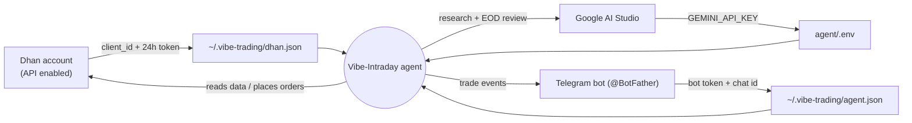
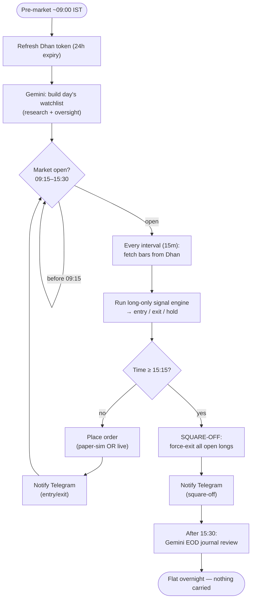
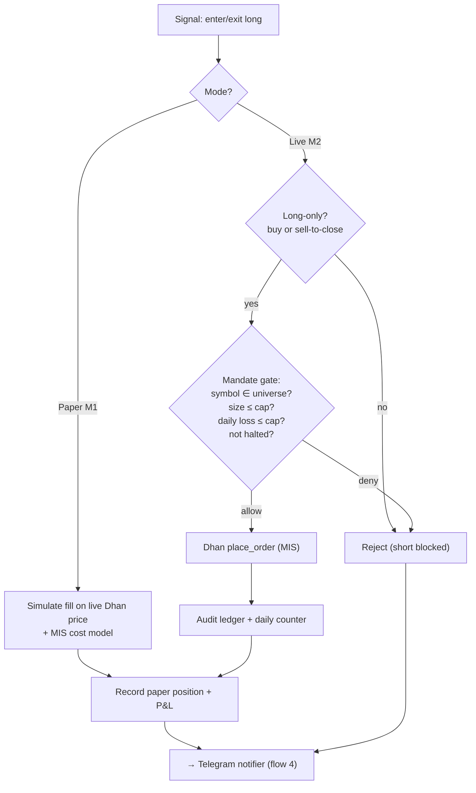
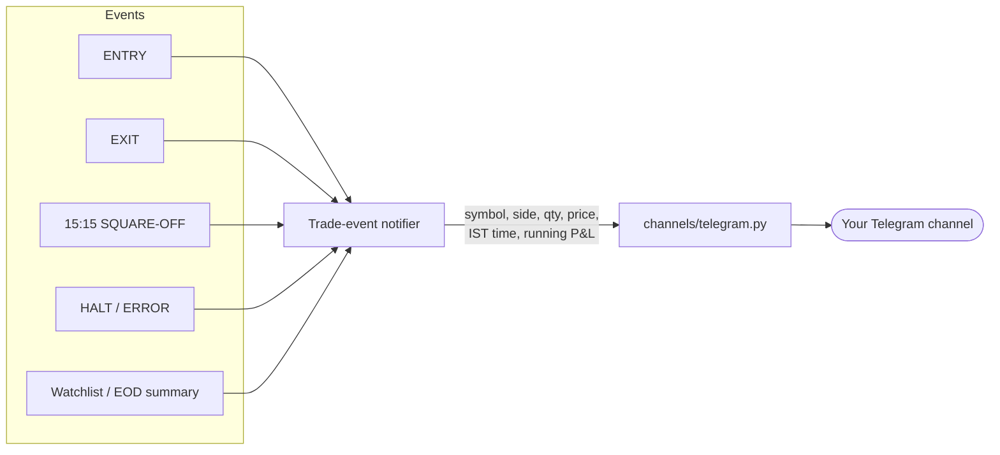
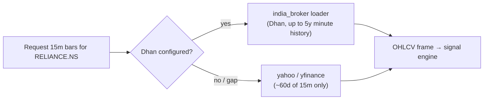
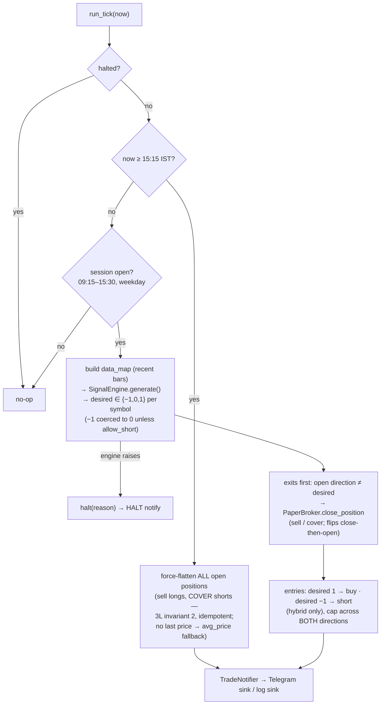
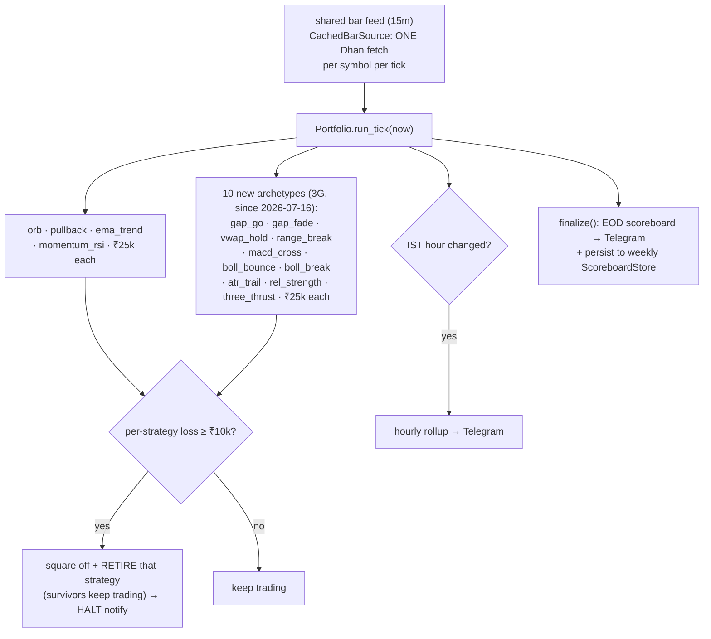
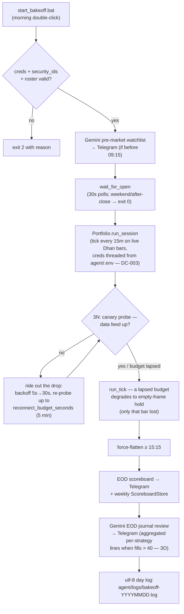
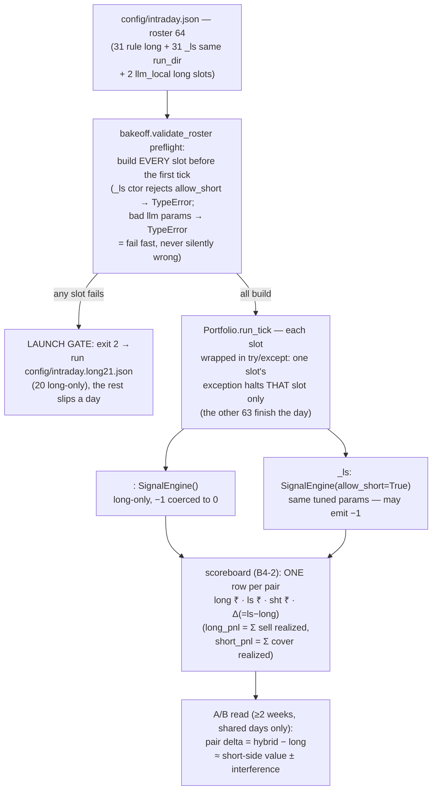

# Vibe-Intraday — Flows

Mermaid diagrams for every major flow. Update these whenever a flow changes.

- [1. Account linking (credentials)](#1-account-linking--credentials)
- [2. Daily intraday trading loop](#2-daily-intraday-trading-loop)
- [3. Order path: paper vs live gate](#3-order-path--paper-vs-live-gate)
- [4. Trade → Telegram notification flow](#4-trade--telegram-notification-flow)
- [5. Data fetch + fallback](#5-data-fetch--fallback)
- [6. Paper runtime tick (as-built, `src/intraday`)](#6-paper-runtime-tick-as-built)
- [7. Week-1 parallel bake-off (`src/intraday/portfolio`)](#7-week-1-parallel-bake-off)

---

## 1. Account linking / credentials

Three independent credentials, one hub process. No cross-account OAuth.

---

## 2. Daily intraday trading loop

Runs unattended during market hours (IST). Same shape for paper and live; only the
order step differs (see flow 3).

---

## 3. Order path — paper vs live gate

Paper-first: the same signal drives a simulated fill now, and a mandate-gated live order
only after Milestone M2. Long-only means the gate also rejects any non-buy/sell-to-close.

---

## 4. Trade → Telegram notification flow

One central notifier for both paper and live, so the Telegram feed is identical in both
modes. Sink only — never places or approves orders.

---

## 5. Data fetch + fallback

Intraday bars come from Dhan (your live account). The repo's fallback chain for
`india_equity` is `yahoo → yfinance → india_broker → local`; for intraday we prefer the
broker (Dhan) source because Yahoo 15m history is capped at ~60 days.

> Note: flows 3 (live path), and the token-refresh + scheduler in flow 2, are **designed
> here but not built** — implementation is Phase 3+. Diagrams will be revised if the design
> changes during build.

---

## 6. Paper runtime tick (as-built)

The M1 paper loop as implemented in `src/intraday/runner.py::run_tick(now)`. Fail-closed order,
fully injectable (replay bars + frozen clock make it unit-testable with no live services).

Bookends (outside the tick): `gemini_jobs.premarket_watchlist` before open and
`gemini_jobs.eod_review` after close post the day's watchlist + journal to the same feed.
Paper fills at the observed bar's **close**; the strategy's own flat-by-15:00 rule still
applies, with 15:15 as the authoritative backstop. Live orders remain out of scope (M2).

---

## 7. Week-1 parallel bake-off

`src/intraday/portfolio.py` — the 4 strategies run side by side on one shared bar feed, each in an
isolated ₹25k paper account, ranked at week's end on net-of-cost P&L.

> **Since 3M (2026-07-16):** the `llm_trader` **Gemini** slot was removed from the roster on cost grounds; Gemini is research/oversight only (pre-market watchlist + EOD review).
> **Since 3R (2026-07-17):** the LLM slot is revived on **local Ollama** — two long-only candidate slots, `llm_local_a` (llama3.1:8b) and `llm_local_b` (qwen3:8b), share `builtin:llm_trader` via per-slot roster `params` (`provider`/`model`). Zero marginal cost, no quota, no WAN. BUG-005 lessons built in: slot-tagged journal/logs; after 3 consecutive failed calls the slot goes **degraded = flat** (never frozen on stale decisions), a success resets it. The scoreboard picks between the two candidates.
> **Since 3P (2026-07-17):** the EOD scoreboard leads with a topline `Σ net · fees · trades · P of M profitable`. (3P's hourly per-slot diet — idle-collapse, movers-first, 8-fill cap, `⇅ legs` — was sized for ~42 slots and is **superseded by B4-2** below.)
> **Since B4-2 (2026-07-19, for the 64-slot roster):** both reports **collapse each long/`_ls` pair to one line** so the A/B delta reads directly. Hourly = one row per pair `long · ls · sht · Δ(=ls−long) · f · h`, **all pairs** shown movers-first (by max |leg net|); EOD = one pair row ranked by best leg. Halted pairs are **always shown** (both legs, ✖ on the retired leg); unpaired `llm_local_a/b` get their own line (a halted one flagged ✖). A hard **≤3-chunk cap** (`scoreboard._cap_report` over `notifier.split_for_telegram`) truncates with `… +N more pairs (log)`. This cut the hourly from 4→1 chunk and the EOD from 2→1 chunk at 64 slots. Full per-fill detail always survives in the log tape.

Per-trade ENTRY/EXIT go to each strategy's **log tape** (not Telegram) to keep the feed quiet; the
feed carries only the hourly rollup, the EOD scoreboard, and kill-switch HALTs. The ₹10k cutoff is
**per strategy** and **permanent** for the run (a disqualified setup is out for good), not an aggregate
or daily limit. Over the week the scoreboard accumulates one record per (date × strategy); the
weekly table decides which setup (if any) graduates to an M2 live test.

## 8. One trading day via the launcher (as-run since 2026-07-15)

`src/intraday/bakeoff.py` (started by `start_bakeoff.bat` each morning) wires the whole day:

One invocation = one trading day (the Dhan token expires every 24h, so a fresh morning start is
the natural unit — refresh the token in `agent/.env` first).

**Bookend reliability (3O, BUG-006):** both Gemini bookends now retry **transient** failures
(timeout / transport / 5xx / 429) up to 3 attempts (2s/8s); if retries are exhausted, the prompt
runs through **local Ollama** (`ollama_url`/`ollama_model` config) and posts with a `[local]`
prefix — the static `"(no watchlist)"`/`"(no review)"` placeholder is the last resort only. A
quota-429 (daily free-tier reset ≈ 12:30 IST = midnight Pacific) therefore degrades to a local
model's text instead of silence.

---

## 9. 3L long-vs-hybrid A/B (live from 2026-07-16)

Every long-only rule slot gets a `_ls` twin sharing the **same** `signal_engine.py` source, built
with `allow_short=True`. Since 3R (2026-07-17) the process runs **42 slots**: the 20 + 20 rule
pairs below plus the two long-only local-LLM candidates (`llm_local_a`/`llm_local_b`, flow 7 —
outside this A/B). Any pair delta over shared days ≈ the value of the short side alone (per-leg
decomposition exposes slot interference).

Shorts are **paper-only** (user decision 2026-07-15): the M2 live gate in flow 3 still rejects
non-long orders — promoting any short-capable setup to live needs its own explicit decision.
Short mechanics: 1x reserve (notional + entry commission), STT on the short leg / stamp on the
cover, one direction per symbol per account, 15:15 force-cover is a hard invariant (flow 6).
